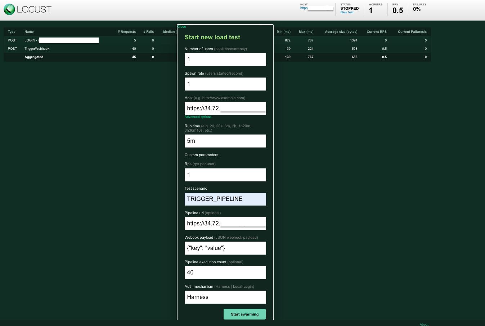

## Harness Performance Testing Framework

This document outlines all the necessary details required for:
1. Setting up a performance test tool (Locust - https://locust.io/) to generate load on Harness system
2. Python scripts that emulate actual user scenarios via Harness apis https://apidocs.harness.io/

### [Project structure](#)
- data : contains harness username list
- kubernetes-config : locust master and worker deployment yaml
- locust_tasks : test scripts and api helpers
- resources : request payload files
- locust_tasks > tasks.py : execution starting point and all the test scripts have to be imported here

### [Test data setup](#)

#### 1. Add new users in account for test runs
Add users into Harness account with random password and list them in [credentials.csv](../data/on-prem/credentials.csv)
These credentials will be used during test runs for performing authentication

> eg: auto_perf_1597@mailinator.com

#### 2. Add github userIds and tokens as Harness secrets
Referred in locust test scripts while creating or running pipelines

#### 3. Add github repo url as Harness variable
Referred in locust test scripts while creating or running harness CI/CD pipelines

#### 4. Populate Harness data
Add 100 organisations and 20 projects in each organisation to populate some data in Harness account

Above 2, 3, 4 can be added using script [testdata.sh](../data/scripts/testdata.sh)  
**Imp:** Change inputs in script to valid values and execute

#### 5. Add delegate in Harness account with tag : perf-delegate

### [Locust installation](#)

#### Set up Locust on local machine
1. Install python3 ```brew install python3 ```  
2. Install Locust > ```pip3 install locust```  
3. Git clone  
4. Navigate to cloned repo directory  
5. Execute > ```locust -f locust_tasks/tasks```

#### Set up Locust on GCP cluster  
1. Connect to GCP cluster
2. Procure static IP address 
2. Update GCP project, cluster namespace and locust master url (static ip) in [variables.sh](../variables.sh)
3. Execute [install.sh](../install.sh) under cloned directory
> ./install.sh

### [Test Execution](#)

#### Execute test scripts via locust webUI

1. Navigate to http://0.0.0.0:8089/ (on local setup) or Locust master URL    

  
2. Parameters
``` 
Number of users : Total concurrent users [eg: 1]

Spawn rate : Time to spawn all users [eg: 1 (in seconds)]

Host : <Harness URL> [eg: http://<ip_address>]

Run time : Test duration [eg: 5m]
note: Click on Advanced options to view this field

Test scenario : Test class to execute 
eg: CI_CREATE_PIPELINE,CI_EXECUTE_PIPELINE (single or comma separated class names)

Pipeline url (optional) : Pipeline url to execute ‘n’ times 
eg: http://<ip_address>/ng/account/DbSRs-u5QgukRP_ODtvGkw/ci/orgs/default/projects/ScaleTestPOC/pipelines/CITest/pipeline-studio/?storeType=INLINE
Pick pipeline link from Harness UI Left menu > Builds > Select Project > Click Pipelines on left > Click on pipeline name

Pipeline execution count (optional) : no. of times pipeline should run [eg: 50]
```



#### Execute test scripts via Curl

> curl --location '<LOCUST_MASTER_URL>/swarm' \
--header 'Content-Type: application/x-www-form-urlencoded; charset=UTF-8' \
--data 'user_count=2&spawn_rate=1&host=<HARNESS_SMP_URL>&run_time=2m&test_scenario=CI_CREATE_PIPELINE,CI_EXECUTE_PIPELINE&pipeline_url=&pipeline_execution_count=1'  
  

### [View Results](#)

#### Statistics 
> capture no. of requests, failures, 99%ile, avg response time, etc.  

Navigate to locust server URL while tests are running to view real time metrics


#### Locust Reports
> capture requests, failures, etc.


### [Test Scripts (scenarios)](#)

  
  

| Scenario                                 | Pre-requisite data                                                                                                                                                                                                                                                                                                                                                               | Locust params                                                                                                                                         | Comments                                                                                                                                                       |
|:-----------------------------------------|----------------------------------------------------------------------------------------------------------------------------------------------------------------------------------------------------------------------------------------------------------------------------------------------------------------------------------------------------------------------------------|-------------------------------------------------------------------------------------------------------------------------------------------------------|----------------------------------------------------------------------------------------------------------------------------------------------------------------|
| Execute CI pipeline 'n' times            | Create Organization, project, connectors, <br/>step template and pipeline                                                                                                                                                                                                                                                                                                        | Test scenario : CI_PIPELINE_RUN<br/> Pipeline url: blank<br/>Pipeline execution count : 10                                                            |                                                                                                                                                                |
| Execute CI pipeline with gitX  ‘n’ times | Create Organization, project, 15 github code repo connectors, 15 gitX (step template, stage template, pipelines, pipeline input set, pipeline triggers) <br/> <br/>Manual steps :<br/> 1. Add Harness pipeline trigger 2.Get webhook payload under github repo 3. Add one property {"zen": "$zen"} in webhook payload 4. Replace webhook payload in ci_webhook_payload.json file | Test scenario : CI_PIPELINE_REMOTE_RUN<br/> Pipeline url: blank<br/>Pipeline execution count : 10                                                     | Pipeline is triggered via webhook and each pipeline_execution_count triggers 15 pipelines <br/> <br/>To execute 1500 pipelines - set pipeline_execution_count = 100 |
| Save - Get - Update CI pipeline          | Create Organization, project, 15 github connectors, pipeline template                                                                                                                                                                                                                                                                                                            | Test scenario : CI_PIPELINE_SAVE<br/> Pipeline url: blank<br/>Pipeline execution count : 0                                                            |                                                            ‘n’ users will Save - Get - Update CI pipeline concurrently and repeat until duration                                                                                                    | 
| Save - Get - Update gitX CI pipeline     | Create Organization, project, 15 github connectors, 15 gitX step template, 15 gitX stage templates                                                                                                                                                                                                                                                                               | Test scenario : CI_PIPELINE_REMOTE_SAVE<br/> Pipeline url: blank<br/>Pipeline execution count : 0                                                     |                                                 ‘n’ users will Save - Get - Update gitX CI pipeline concurrently and repeat until duration                                                                                                               |
| Trigger any pipeline or webhook ‘n’ times | Find pipeline link - Open Harness left nav -> Builds -> Select project -> Click on pipelines -> Click on pipeline name -> copy pipeline url<br/><br/> eg: http://<ip_address>/ng/account/DbSRs-u5QgukRP_ODtvGkw/ci/orgs/default/projects/ScaleTestPOC/pipelines/CITest/pipeline-studio/?storeType=INLINE                                                                                                                                                                                                                       | Test scenario : TRIGGER_PIPELINE<br/> Pipeline url: <URL><br/>Pipeline execution count : 10                                                           |                                                                                                                                                                |
| User behaviour under steady load    |               Create Organizations, projects, connectors, 200 pipeline and execute them                                                                                                                                                                                                                                                                                                                                                                   | Test scenario : CI_CREATE_PIPELINE,CI_EXECUTE_PIPELINE,<br/>CI_UPDATE_PIPELINE,CI_VIEW_EXECUTION<br/> Pipeline url: blank<br/>Pipeline execution count : 0 |                                                                                                                                                                |
| Create and execute a CD K8s pipeline 'n' times            | Create K8s service, env, infra, connectors, pipeline and execute                                                                                                                                                                                                                                                                                                        | Test scenario : CD_PIPELINE_RUN<br/> Pipeline url: blank<br/>Pipeline execution count : n                                                            |                                                                                                                                                                |
|                                          |                                                                                                                                                                                                                                                                                                                                                                                  |                                                                                                                                                       |                                                                                                                                                                |

